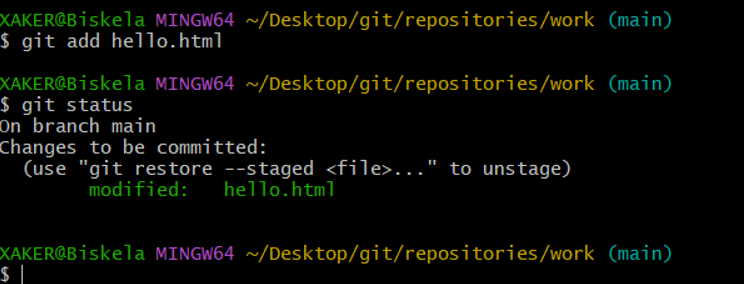
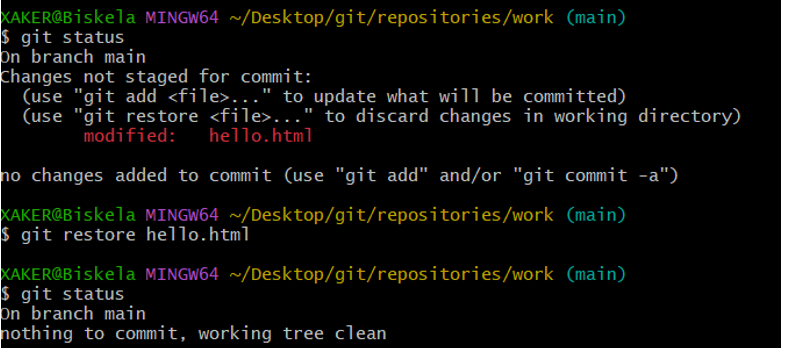
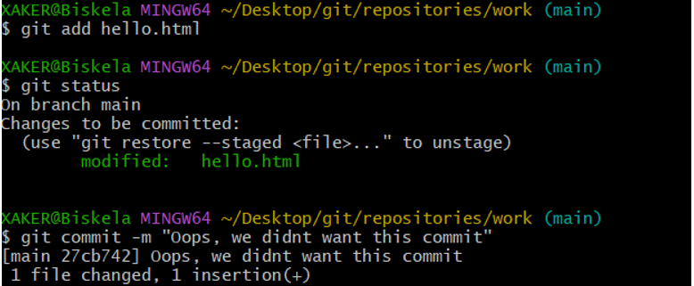
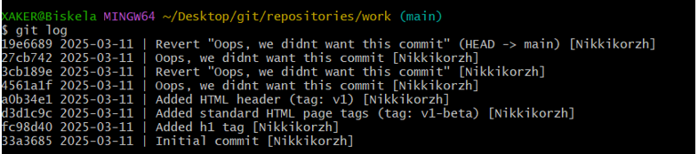
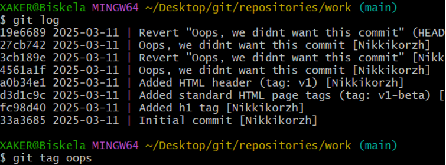
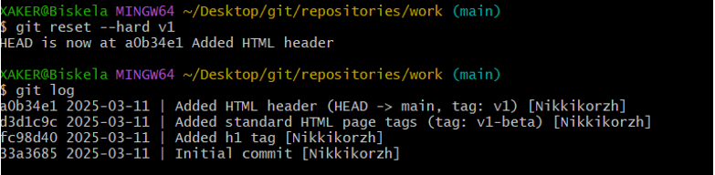
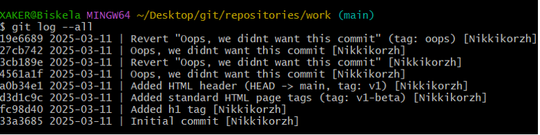

<h1>Завдання 1</h1>
Встановлюємо адресу електроної пошти

Встановлюємо назву гілки за замовчуванням

Додаємо коректні обробку закінчень рядків

<h1>Завдання 2</h1>
Створюємо папку work та файл hello.html

Створюємо репозиторій та додаємо до нього файл hello.html

<h1>Завдання 3</h1>
Перевіряємо стан репозиторію

<h1>Завдання 4</h1>
Внесення змін

<h1>Завдання 5</h1>
Індексація змін за допомогою команди git add

<h1>Завдання 6</h1>
Індексація змін та коміт. Було виконано коміт за допомогою команди git commit
<h1>Завдання 7</h1>
Коміт змін

<h1>Завдання 8</h1>
Зміни, а не файли

<h1>Завдання 9</h1>
Зміни, а не файли

<h1>Завдання 10</h1>
Зміни, а не файли

<h1>Завдання 11</h1>
Створення тегів версій

<h1>Завдання 12</h1>
Скасування локальних змін до індексації за допомогою команди git restore

<h1>Завдання 13</h1>
Скасування проіндексованиз змін до коміту

<h1>Завдання 14</h1>
Скасування комітів

<h1>Завдання 15</h1>
Видалення комітів з гілки

<h1>Завдання 16</h1>
Видалення тегу "oops"

<h1>Завдання 17</h1>
Внесення змін до комітів

<h1>Завдання 18</h1>
Створення гілки

<h1>Завдання 19</h1>
Перемикання гілок

<h1>Завдання 20</h1>
Переміщення файлів

<h1>Завдання 21</h1>
Зміни в гілці main

<h1>Завдання 22</h1>
Приклад розбіжних гілок

<h1>Завдання 23</h1>
Злиття

<h1>Завдання 24</h1>
Створення конфлікту

<h1>Завдання 25</h1>
Вирішення конфлікту

<h1>Завдання 27</h1>
Відкочування гілки style

<h1>Завдання 28</h1>
Перебазування

<h1>Завдання 29</h1>
Злиття в гілку main

<h1>Частина 2. Завдання 30</h1>
Клонування репозиторіїв

<h1>Завдання 31</h1>
Клонування репозиторіїв

<h1>Завдання 32</h1>
Що таке origin?

<h1>Завдання 33</h1>
Віддалені гілки

<h1>Завдання 34</h1>
Зміна оригінального репозиторію

<h1>Завдання 35</h1>
Підтягування змін

<h1>Завдання 36</h1>
Злиття підтягнутих змін

<h1>Завдання 37</h1>
Додавання гілки відстеженні

<h1>Завдання 38</h1>
Чисті репозиторії

<h1>Завдання 39</h1>
Додали віддалений репозиторій

<h1>Завдання 40</h1>
Відправка змін

<h1>Завдання 41</h1>
Підтягування спільних змін

<h1>Завдання 42</h1>
Розміщення ваших Git репозиторіїв

