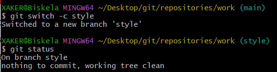

<h1>Завдання 1</h1>
Встановлюємо адресу електроної пошти

Скріншот логіну
Встановлюємо назву гілки за замовчуванням

Скріншот гілки
Додаємо коректні обробку закінчень рядків

Обробка рядків
<h1>Завдання 2</h1>
Створюємо папку work та файл hello.html

Папка та файл
Створюємо репозиторій та додаємо до нього файл hello.html

Репозиторій
<h1>Завдання 3</h1>
Перевіряємо стан репозиторію

Стан
<h1>Завдання 4</h1>
Внесення змін

Перевірка стану
<h1>Завдання 5</h1>
Індексація змін за допомогою команди git add

Індексація змін
<h1>Завдання 6</h1>
Індексація змін та коміт. Було виконано коміт за допомогою команди git commit
<h1>Завдання 7</h1>
Коміт змін

Коміт - Added h1 tag

Перевірка стану
<h1>Завдання 8</h1>
Зміни, а не файли

Додавання першої зміни та перевірка стану

Додавання другої зміни та перевірка стану

Коміт другої зміни
<h1>Завдання 9</h1>
Історія проєкту

Перегляд історії проекту за допомогою команди git log

Перегляд історії проекту (однорядковий) за допомогою команди git log --pretty=oneline

Історія проекту за останні тиждень

Остання версія перегляду проекту
<h1>Завдання 10</h1>
Отримання старих версій

Отримання хешів попередніх комітів

Повернення до останньої версії в гілці main
<h1>Завдання 11</h1>
Переглядаємо наявні гілки та створюємо нову

Перегляд гілок та створення нової
<h1>Завдання 12</h1>
Перемикаємося між гілками

Перемкання між гілками
<h1>Завдання 13</h1>
Редагуємо файл у новій гілці

Редагування у гілці
<h1>Завдання 14</h1>
Злиття гілки

Злиття гілки
<h1>Завдання 15</h1>
Видалення гілки

Видалення гілки
<h1>Завдання 16</h1>
Видалення тегу "oops"

Видалення тегу  'oops' на який не посилаються ані теги, ані гілки
<h1>Завдання 17</h1>
Внесення змін до комітів

Змінили файл hello.html та робимо коміт

Змінимо знову файл hello.html та змінимо попередній коміт
<h1>Завдання 18</h1>
Створення гілки

Створили гілку та перевірили, що ми знаходимось саме в ній

Створили файл стилів

Зробили два коміти
<h1>Завдання 19</h1>
Перемикання гілок

Переглянули історію комітів

Перемкнули гілки та переглянули файл hello.html

Повернулись до гілки style та перевірили файл hello.html
<h1>Завдання 20</h1>
Переміщення файлів

Переглянули історію комітів файлів style.css та hello.html

Переглянули різницю між цими файлами

Перейменували файл hello.html

Проіндексували зміни

Перемістили style.css та зробили відповідний коміт. Переглянули історію комітів до переміщення
<h1>Завдання 21</h1>
Зміни в гілці main

Перейшли у гілку main

Змінли файл README та зробили коміт
<h1>Завдання 22</h1>
Приклад розбіжних гілок

Переглянули усі гілки
<h1>Завдання 23</h1>
Злиття
Злиття гілок за допомогою merge
<h1>Завдання 24</h1>
Створення конфлікту

Проіндексували зміни та зробили коміт

Переглянули гілки
<h1>Завдання 25</h1>
Вирішення конфлікту

Перемкнулися до гілки style та злили зміни з main

Переглянули статус

Скасували злиття та повернулись до попереднього стану

Запустили злиття з вирішеним конфліктом

Переглянули стан репозиторію
<h1>Завдання 27</h1>
Відкочування гілки style

Перемикнулись на гілку style та переглянули історію комітів

Відкачуємо коміт з гілки за допомогою gir reset --hard
<h1>Завдання 28</h1>
Перебазування

Перемикнулись на гілку style та перебазовую гілку style на main

Перегляд стану репозиторія

Після виконання команди git --rebase continue переглядає історію комітів та стан репозиторію
<h1>Завдання 29</h1>
Злиття в гілку main

Перемикнулись на гілку main

"Злиття з гілкою style та перегляд логів
<h1>Частина 2. Завдання 30</h1>
Клонування репозиторіїв

Склонували репозиторій
<h1>Завдання 31</h1>
Клонування репозиторіїв

Переглянули файли репозиторію та історію його комітів
<h1>Завдання 32</h1>
Що таке origin?

Переглянули ім'я за замовчуванням віддаленого репозиторію та більш детальну інформацію
<h1>Завдання 33</h1>
Віддалені гілки

<spanПереглянули локальні гілки доступні в репозиторії та всі його віддалені гілки (git branch -a)
<h1>Завдання 34</h1>
Зміна оригінального репозиторію

Проіндексували зміни та зробили коміт
<h1>Завдання 35</h1>
Підтягування змін

Підтягнули коміти з віддаленого репозиторію за допомогою команди git fetchт
<h1>Завдання 36</h1>
Злиття підтягнутих змін

Злили підтягнуті зміни у локальні гілки (git merge origin/main) та перевірили файл README.md
<h1>Завдання 37</h1>
Додавання гілки відстеженні

Додали локальну гілку, яка буде відстежувати віддалену гілку
<h1>Завдання 38</h1>
Чисті репозиторії

Створили чистий репозиторій work.git
<h1>Завдання 39</h1>
Додали віддалений репозиторій

Додали репозиторій work.git до оригінального репозиторія за допомогою git remote add shared
<h1>Завдання 40</h1>
Відправка змін

Зробили зміни у файлі README та надіслали ці зміни до репозиторію work.git
<h1>Завдання 41</h1>
Підтягування спільних змін

Перемкнулися до репозиторію /home

Виконали кроки з минулого завдання, тим самим підтягнувши зміни
<h1>Завдання 42</h1>
Розміщення ваших Git репозиторіїв

Запустили git-сервер

Склонували репозиторій
